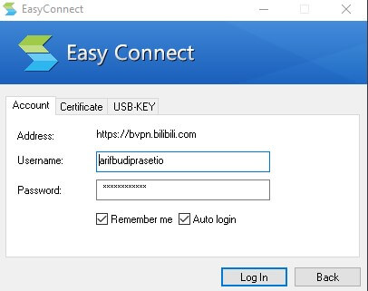
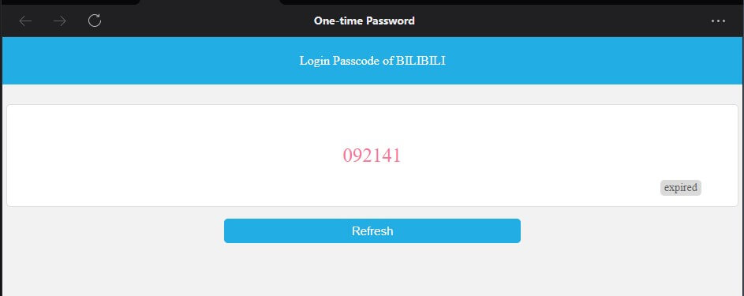

# 🚀 How to Set Up BVPN for Windows

Follow this step-by-step guide to install and connect to **BVPN** so you can access internal resources from your device.

---

## 📥 Download for Windows

- 👉 [Download the installer](https://bvpn.bilibili.com/com/setup.html?4) for your environment (Windows, macOS, Android, iOS).
- 💾 Run the installer and **follow the instructions** until the setup is completed.
- ✅ Once installed, open the application.

---

## 🔐 Connect to BVPN

1. In the **VPN address field**, enter:
   ```
   https://bvpn.bilibili.com
   ```
2. Click **Connect**.

---

## 👤 Login to BVPN

- Use your **Bilibili email username** (without `@bilibili.com`) as the username.
- Enter your **Bilibili password**.

Example:
```
Username: arifbudiprasetio
Password: ••••••••
```

Click **Login**.


---

## 🔑 One-Time Password (OTP)

- After login, you'll be asked for a **One-Time Password (OTP)**.
- Open **WeCom**, go to:
  ```
  Workspace → One-time Password
  ```


- Copy or click the **6-digit OTP** code provided.

- Paste or input it into the VPN prompt and submit.


---

## ✅ Final Steps

- Once connected successfully, the BVPN app will minimize into the system tray (bottom-right corner of your screen).
- You can now access the **intranet sites** or other internal resources securely.

---

> 💡 Tip: You can always reopen the BVPN app from the system tray if you need to disconnect or view status.

---

Happy browsing! 🌐🔐
