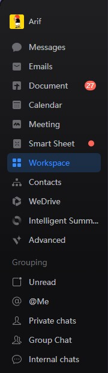
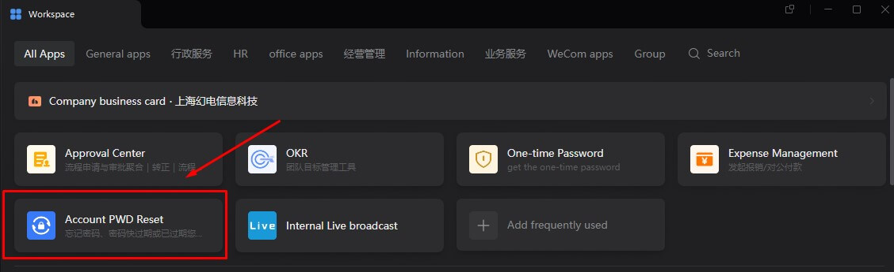
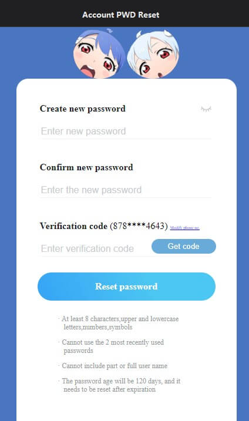
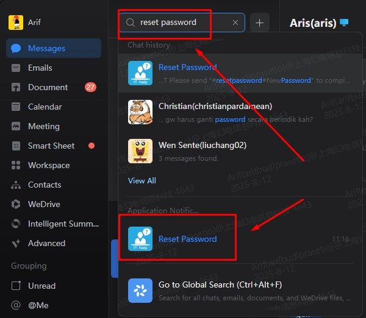
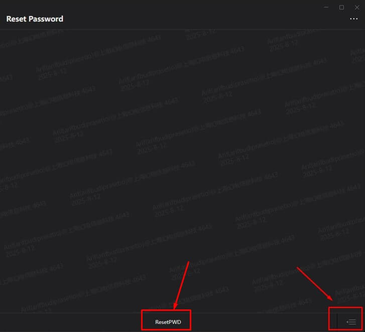
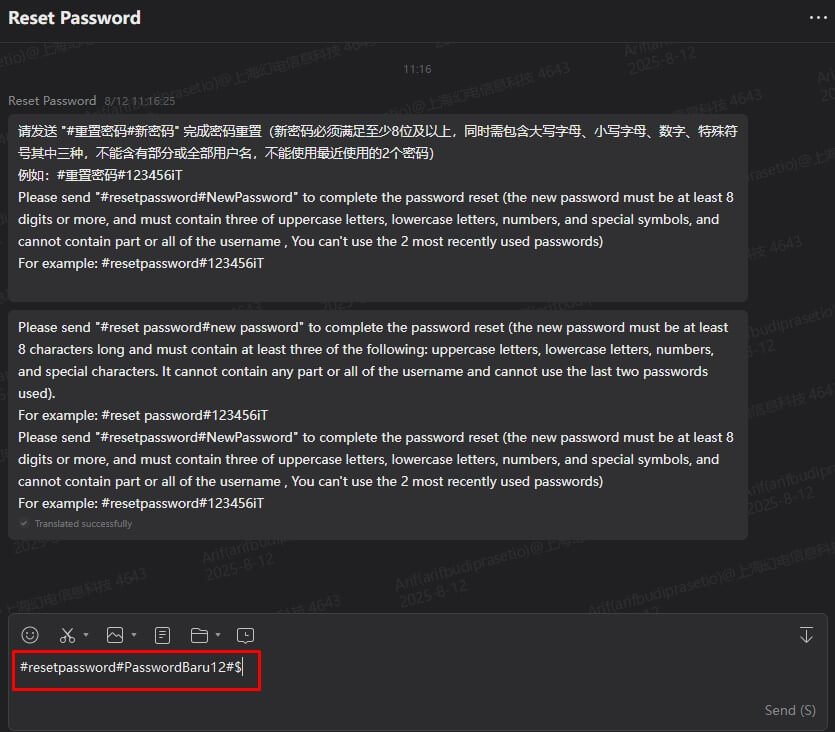

## Introduction
Our company enforces a **password renewal policy every 120 days** to maintain account security and protect company resources. Once your password is nearing expiration, you should renew it promptly to avoid account lockouts.


---
## Below are the available methods to reset or renew your password.


```
1. Using the Account Reset Password Function in Workspace
```


**Steps to reproduce:**
1. Open **Workspace** from the left tab in **WeCom**.  

2. Choose **Account PWD Reset**.  

3. Follow the steps provided in the form to complete your password reset.

---

```
2. Using the Reset Password Chat Application in WeCom Chat
```

**Steps to reproduce:**
1. Find **Reset Password** in the WeCom chat search bar.  

2. Click the **Expand** button to open the chat and view the instructions. 

3. Follow the reset format provided in the chat to reset your password.
> the format is #resetpassword#newpassword and this is example of format #resetpassword#P@ssw0rd


---


```
3. Through IT Support (OTP Required)
```

If you are unable to reset the password using method above, you can contact the IT team:  
1. Request password reset assistance from IT.  
2. IT will require an **OTP** (One-Time Password), which you can retrieve from your **WeCom** chat.  
3. Provide the OTP to IT so they can complete the reset.


---

## Reminder
- Renew your password **before** the 120-day period ends.  
- Use a **strong** and **unique** password.  
- Never share your password with anyone.  
